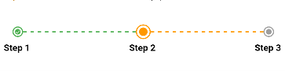
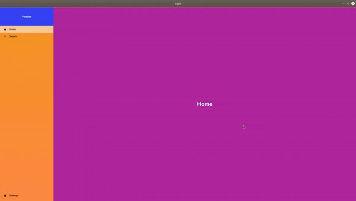

# Aqua

Utility classes/functions to help with UI development using the Flutter framework.

It is recommended to use the `as` keyword with the `import` statement when importing the package to prevent name conflicts, for example...
```dart
import 'package:aqua/aqua.dart' as aqua
```

To log output to file 
```dart
await aqua.log('data to log', 'path/to/file', clear: true, time: true);
```

To save data to device
```dart
Future<void> save() async {
  var id = 'id';
  var _value = 1920;
  await aqua.Pref.set(id, value);
  var value = await aqua.Pref.get(id);
}
```

Show time in terms of hours and minutes and days ago
```dart
var time = aqua.readTimestamp(DateTime.now().millisecondsSinceEpoch / 1000);
```

To put a block of code in a try catch
```dart

// the argument for tryCatch could either be a callback to a function or a future

// as a function
Widget  _buildWidget(){
  // may fail to build for some reason
}
var child = await aqua.tryCatch(_buildWidget(), verbose: true);

// as a future
Future<Widget> _buildWidget() async {
  // may fail to build for some reason
}

var future = _buildWidget();
var child = await aqua.tryCatch(future, verbose: true);


if(child != null){
  // proceed
}

```

Interacting with APIs from remote locations
```dart
// posting to an endpoint
var fromServer = await aqua.Client(
  '192.168.1.100', //ip
  8080, // port
  '/test', // endpoint
  query: {
    'id': 1,
  }, // post parameters
  verbose: true
).getResponse();

// or

var client = aqua.Client(
  '192.168.1.100', //ip
  8080, // port
  '/test', // endpoint
  query: {
    'id': 1,
  }, // post parameters
  verbose: true
);

var fromServer = await client.getResponse(); // defaults to POST
if(client.statusCode == 200){
  // some code
}

// a real end point would look like this
// the end point is free to use
// you can find the rest of the endpoints here: https://www.coingecko.com/en/api
var fromServer = await aqua.Client(
  'api.coingecko.com',
  443,
  '/api/v3/coins/markets',
  isSecured: true,
  query: {
    'vs_currency': 'usd',
    'order': 'market_cap_desc',
    'per_page': '20',
    'page': '1',
    'sparkline': 'true'
  },
  verbose: true
).getResponse(method: 'GET');

// other parameters include
var client = aqua.Client(
  '192.168.1.2',
  8080,
  '/test',
  headers: <String, String>{
    'Authorization': 'Bearer $yourtoken'
  },
  query: {
    'id': 1
  }
  isSecured: true,
  verbose: constants.Api.verbose,
  expectedStatusCodes: [201] // not a must, assumes you know your status codes for api
);

var fromServer = await client.getResponse(); //defaults to POST, others include GET, PUT, DELETE
if(client.statusCode == 201){
  // some code
}

```

set timeouts when interacting with remote Apis, and onTimeout callbacks for when timeout is reached;
timeout is in milliseconds
```dart
var fromServer = await aqua.Client(
  'api.coingecko.com',
  443,
  '/api/v3/coins/markets',
  isSecured: true,
  query: {
    'vs_currency': 'usd',
    'order': 'market_cap_desc',
    'per_page': '20',
    'page': '1',
    'sparkline': 'true'
  },
  verbose: true,
  timeout: 300,
  onTimeout: (){
    // callback to handle this scenario
    //eg inform widget of the timeout, and perharps retry
    // how you retry this request is up to you
    streamController.sink.add('/api/v3/coins/markets timeout out');
  }
).getResponse(method: 'GET');
```

**`DESKTOP ONLY`** To allow for mouse pointers to change to click icons on hovering on a clickable widget
```dart
@override
Widget build(BuildContext context){
  
  // some code
  // then
  return aqua.MouseInteractivity(
    child: child
  );
}
```

To get a random index between a range of indexes
```dart
var index = aqua.getRandomNumber(min: 10, max: 10000);
```

To output info on screen with different colors
```dart

aqua.pretifyOutput('to print on screen'); // will print in green
aqua.pretifyOutput('to print on screen', color: 'red'); // white, red, magenta, yellow, cyan, blue, defaults to green
```

To obscure text
```dart
var obscured = aqua.obscureText('obscured');
```

show snackbar; must use a scaffold for this to work
```dart
aqua.showSnackbar(
  'info',
  context,
  color: Colors.red,
  bgColor: Colors.black,
  mounted=mounted // flutter value,
  seconds=1
);
```

Check for email syntax or digits without characters
```dart
var isEmail = aqua.Validators.isEmail('email');
var isNumber = aqua.Validartors.isNumber('1234132');
```

Disallow listview glow
```dart
@override
Widget build(BuildContext context){
  return aqua.disallowGlow(ListView());
}
```

To add a shadowy effect on an image
```dart
@override
Widget build(BuildContext context){
  return aqua.Shadow(
    child: Image(image: AssetImage('/path/to/asset'))
  );
}
```

A quick drop down widget
```dart
@override
Widget build(BuildContext context){
  return aqua.DropDown(
    initValue: 'one',
    items: ['one', 'two', 'three', 'four', 'five', 'six']
  );
}
```

A quick TabBar. Tabs without scaffold...
```dart
@override
Widget build(BuildContext context){
  return Material(
    child: DefaultTabController(
      length: 3,
      child: Column(
        children: [
          aqua.TabHeader(
            tabListing: ['car', 'transit', 'bike'],
          ),

          Expanded(
            child: TabBarView(
              children: [
                Icon(Icons.directions_car),
                Icon(Icons.directions_transit),
                Icon(Icons.directions_bike),
              ],
            ),
          )
        ],
      ),
    )
  );
}
```

To get screen dimensions in scale
```dart
@override
Widget build(BuildContext context){

  aqua.Dimensions().init(context);

  return Container(
    width: aqua.Dimensions.width, // full width of screen
    height: aqua.Dimensions.height, // full height of screen
    color: Colors.red
  );
}
```

To get height and width for an expanded widget
```dart
@override
Widget build(BuildContext context){
  return Column(
    children: [
      Expanded(
        child: aqua.DynamicDimensions(
          renderWidget: (double width, double height){
            return Container(
              width: width,
              height: height
              color: Colors.red,
            );
          }
        ),
      ),
      SizedBox(height: 10.0),
    ]
  );
}
```

To captilaize a word
```dart
var capitalized = aqua.capitalize('alphabet');
print('capitalized: $capitalized);
```

To create a file quickly (will also create the recursive directories on the path)
```dart
await aqua.createFile('/path/to/file');

// to clear a file/truncate a file
await aqua.createFile('/path/to/file', clear: true);
```
To generate a random ID
```dart
var id = aqua.generateUUID(length: 30);
```

To navigate
```dart

// some code
// then

aqua.Dimensions().init(context);
Widget viewOne = Container(
  width: aqua.Dimensions.width,
  height: aqua.Dimensions.height
  color: Colors.blue
);
Widget viewTwo = Container(
  width: aqua.Dimensions.width,
  height: aqua.Dimensions.height
  color: Colors.red
);

// to navigate to the next view without erasing the previous view from state
aqua.CustomNavigator(
  context: context,
  buildScreen: () = > viewOne
).navigateToPage();

// to navigate to the next view and erase the previous view from state
aqua.CustomNavigator(
  context: context,
  replaceSingle: true,
  buildScreen: () = > viewOne
).navigateToPage();

// to navigate to the next view and erase ALL the previous views from state
aqua.CustomNavigator(
  context: context,
  replaceAll: true,
  buildScreen: () = > viewOne
).navigateToPage();

// to navigate to the next view using a named route
aqua.CustomNavigator(
  context: context,
  namedRoute: '/home',
  buildScreen: () = > viewOne
).navigateToPage();
```

To display loader
```dart

Widget loader = aqua.Loader(
  width: width,
  height: height,
  color: color
);
```

To request focus from another widget
```dart
@override
Widget build(BuildContext context){
  
  // some code
  // then
  Widget withFocus = aqua.requestFocus(child, context);

  // make sure to return a widget
}
```

To add commas to numbers
```dart
String number = aqua.pretifyNumber('1000000');
print('number: $number');
```

To clip images into a circular widget
```dart
@override
Widget build(BuildContext context){
  // some code
  // then
  Widget clippedImage = aqua.ClippedCircle(
    child: child // some widget, could be an image, wrapped in a container,
    color: Colors.blue // border of the circle
  );

  // make sure to return a widget
}
```
Sometimes the clipped image might not expand into the container as expected, to force it do so:
```dart
@override
Widget build(BuildContext context){
  // some code
  // then
  Widget clippedImage = aqua.ClippedCircle(
    child: aqua.ImageFit(
      child: child // Image.asset(path/to/file) or even a network image
    ) // some widget, could be an image, wrapped in a container,
    color: Colors.blue // border of the circle
  );

  // make sure to return a widget
}
```

Custom Text Form Widget
```dart

class Play extends StatefulWidget {

  @override
  PlayState createState() => PlayState();

}

class PlayState extends State<Play>{

  FocusNode focusNode;
  TextEditingController textEditingController;

  @override
  void initState(){
    super.initState();

    focusNode = FocusNode();
    textEditingController = TextEditingController();
  }

  @override
  void dispose(){
    focusNode?.dispose();
    textEditingController?.dispose();

    super.dispose();
  }

  @override
  Widget build(BuildContext context){
    aqua.Dimensions().init(context);
    return Column(
      children: [
        Row(
          children: [
            Expanded(
              child: aqua.TextFormFieldCustom(
                borderRadius: 20,
                isOutlineBorder: true, //false
                verticalPadding: 15.0,
                horizontalPadding: 15.0,
                keyboardType: TextInputType.text,
                borderColor: Colors.grey.withOpacity(0.5),
                focusedBorderColor: conf.Colors.orange1,
                cursorColor: conf.Colors.orange1,
                borderWidth: 2,
                hintText: 'hint text',
                hintTextstyle: const TextStyle(
                  color: Colors.black,
                  fontStyle: FontStyle.italic
                ),
                labelTextStyle: const TextStyle(
                  color: Colors.black,
                  fontStyle: FontStyle.italic
                ),
                labelText: 'label',
                focusNode: FocusNode(),
                controller: TextEditingController(),
                prefixIconData: Icons.message,
                prefixIconColor: Colors.grey,
                focusedPrefixIconColor: Colors.green,
                onChanged: (String value, TextEditingController controller){

                },
                isObscureText: true, //false
                prefixIcon: Container() //widget,
                maxLines: 2, // any int,
                streamController: StreamController() // to send back changed values to listeners
              )
            )
          ]
        ),
      ]
    );
  }
}
```

Dotted Line; Separator
```dart
@override
Widget build(BuildContext context){
  // some code
  // then
  Widget separator = Row(
    children: [
      Expanded(
        child: aqua.DottedLine()
      )
    ]
  );
  // make sure to return a widget
}
```

Stepped Progresser; To track progress of an ongoing step by step instructive activity;
It scales to any number of steps; Will render something like this: <br/>

```dart
@override
Widget build(BuildContext context){
  // some code
  // then
  Widget progress = aqua.SteppedProgress(
    steps: ['Step 1', 'Step 2', 'Step 3'],
    thickness: 1.5,
    dashWidth: 5,
    currentStep: 2,
  );
  // make sure to return a widget
}
```

**`FLUTTER DEVICES`** [Window Navigator](#window-navigator), a bit of boilerplate code is needed for this to work ...<br>
To setup your environment for mobile, click [here](https://flutter.dev/)
To setup your environment for desktop, click [here](https://flutter.dev/desktop)

Copy paste the code below to render a screen like this:<br/>


```dart
import 'dart:async';
import 'package:flutter/material.dart';
import 'package:aqua/aqua.dart' as aqua;

class Shell extends StatefulWidget {

  @override
  ShellState createState() => ShellState();
}

class ShellState extends State<Shell>{

  Widget selectedWidget;
  aqua.NavigationStreamer mainNavStreamer;
  StreamSubscription mainNavStreamSubscription;

  @override
  void initState(){
    super.initState();
    mainNavStreamer = aqua.NavigationStreamer();

    mainNavStreamSubscription = mainNavStreamer.listen((data){
      aqua.pretifyOutput('[SHELL] data from nav stream: $data');

      selectedWidget = data['window'];
      setState((){});
    });
  }

  @override
  void dispose(){
    mainNavStreamSubscription.cancel();
    mainNavStreamer.close();
    super.dispose();
  }

  Widget _buildShell(BuildContext context){
    Map<String, Map<String, dynamic>> generatedRoutes = _buildGeneratedRoutes();

    var textStyle = TextStyle(
      fontSize: 30.0,
      color: Colors.white,
      fontWeight: FontWeight.bold
    );

    Widget firstWidget = Container(
      color: Colors.purple,
      child: Center(
        child: Text(
          'Home',
          style: textStyle
        )
      ),
    );

    return Scaffold(
      appBar: null,
      body: SingleChildScrollView(
        child: Container(
          child: Row(

            children: [

              Expanded(
                child: aqua.Navigation(
                  header: Container(
                    width: navWidth,
                    height: 100.0,
                    color: Colors.red,
                    child: Center(
                      child: Text(
                        'Header',
                        style: TextStyle(
                          color: Colors.white,
                          fontWeight: FontWeight.bold
                        ),
                      ),
                    ),
                  ),
                  routes: generatedRoutes,
                  bgColors: <Color>[
                    Colors.blue,
                    Colors.blueAccent
                  ],
                  hoverColor: Colors.brown.withOpacity(0.5),
                  selectedColor: Colors.white.withOpacity(0.5),
                  navStreamer: mainNavStreamer,
                ),
              ),

              Expanded(
                flex: 6,
                child: selectedWidget == null ? aqua.requestFocus(
                  firstWidget,
                  context
                ) : aqua.requestFocus(
                  selectedWidget,
                  context
                )
              ),
            ]
          )
        ),
      ),
    );
  }

  @override
  Widget build(BuildContext context) => _buildShell(context);

  Map<String, Map<String, dynamic>> _buildGeneratedRoutes(){

    var textStyle = TextStyle(
      fontSize: 30.0,
      color: Colors.white,
      fontWeight: FontWeight.bold
    );

    Function _buildIconHelper = (IconData iconData){
      return Icon(iconData, color: Colors.black, size: 15.0,);
    };

    return {
      'Home': {
        'window': aqua.DynammicDimensions(
          renderWidget: (double width, double height){
            return Container(
              width: width,
              height: height,
              color: Colors.purple
            );
          }
        ),
        'icon': _buildIconHelper(Icons.home)
      },
      'Search': {
        'window': aqua.DynammicDimensions(
          renderWidget: (double width, double height){
            return Container(
              width: width,
              height: height,
              color: Colors.red
            );
          }
        ),
        'icon': _buildIconHelper(Icons.search)
      },
      'Settings': {
        'window': aqua.DynammicDimensions(
          renderWidget: (double width, double height){
            return Container(
              width: width,
              height: height,
              color: Colors.blue
            );
          }
        ),,
        'icon': _buildIconHelper(Icons.settings)
      }
    };
  }
}
```